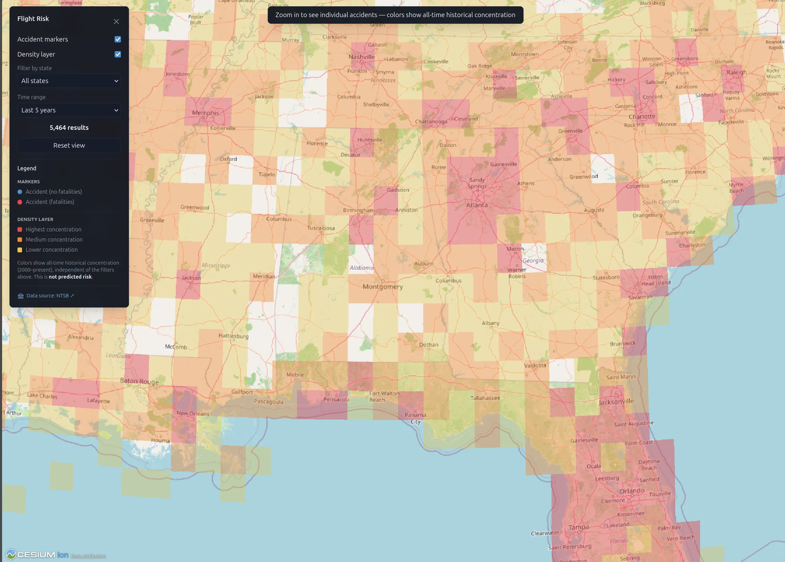
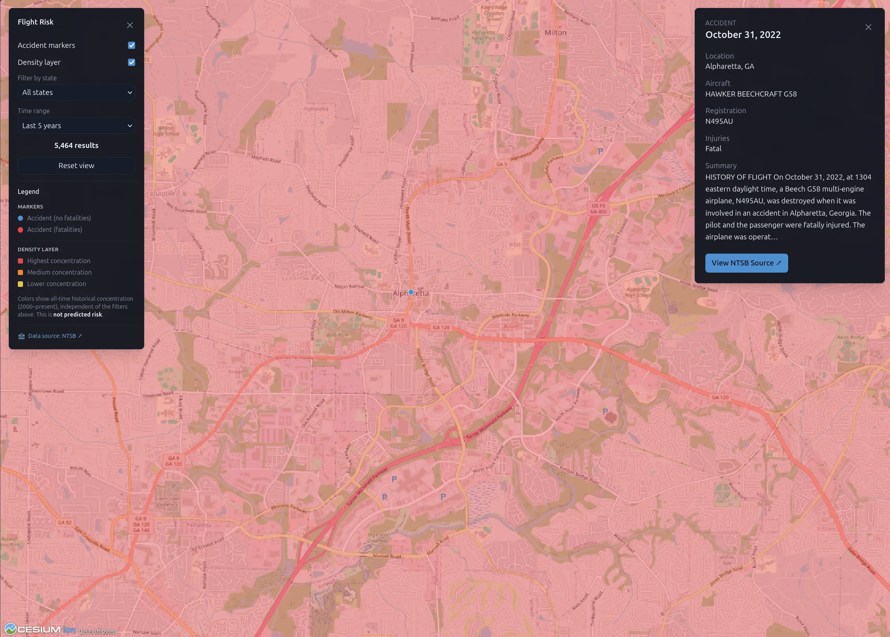

# Flight Risk

**[flight-risk.fyi](https://flight-risk.fyi)**

An interactive 3D globe of historical US aviation accidents, built with Vue 3, TypeScript, and
CesiumJS.

<p float="left">
  
  
</p>

## What it is

Flight Risk plots over 39,500 NTSB-recorded aviation accidents (2000–present) on a 3D globe.
Zoom into a region to see individual accidents as markers — color-coded by whether the accident
involved fatalities — and click one for the full record: date, location, aircraft, injuries, and
a link back to the original NTSB investigation. Zoomed out, a heatmap layer shows where accidents
have historically concentrated.

## How it's meant to be used

Filter by state and time range to explore patterns — where accidents cluster, how frequency has
changed over the last 5, 20, or all recorded years, which regions see more general aviation
activity/incidents. It's a research and curiosity tool for exploring historical data, aviation
enthusiasts, students, and anyone wanting to see US aviation safety history spatially rather than
as a spreadsheet.

**It is not a predictive tool.** The concentration overlay reflects where accidents have
happened historically — it is not a risk forecast, and higher historical concentration in an area
often just reflects more flight activity there, not more danger per flight.

## Data source

All accident data comes from the [NTSB](https://www.ntsb.gov)'s CAROL (Case Analysis and
Reporting Online) database, the U.S. National Transportation Safety Board's public accident
investigation records. Data is fetched and normalized on a manual basis (see `ingestion/`) —
it reflects whatever was last pulled, not a live feed.

## Stack

Vue 3 · TypeScript · CesiumJS · Tailwind CSS · Vite — deployed as a static site on AWS
(S3 + CloudFront) via Terraform (`infra/`).

## Running locally

```bash
npm install
npm run dev
```

To regenerate the accident data from NTSB (takes a few minutes):

```bash
cd ingestion
npm install
npm run ingest
```
